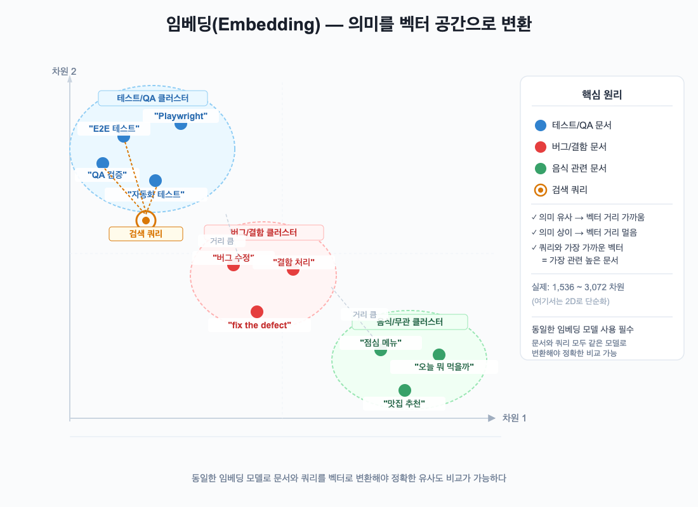
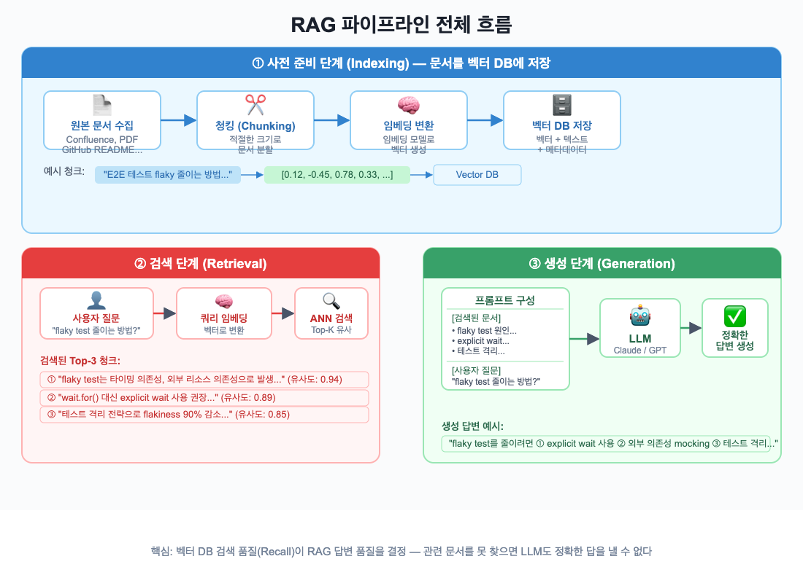
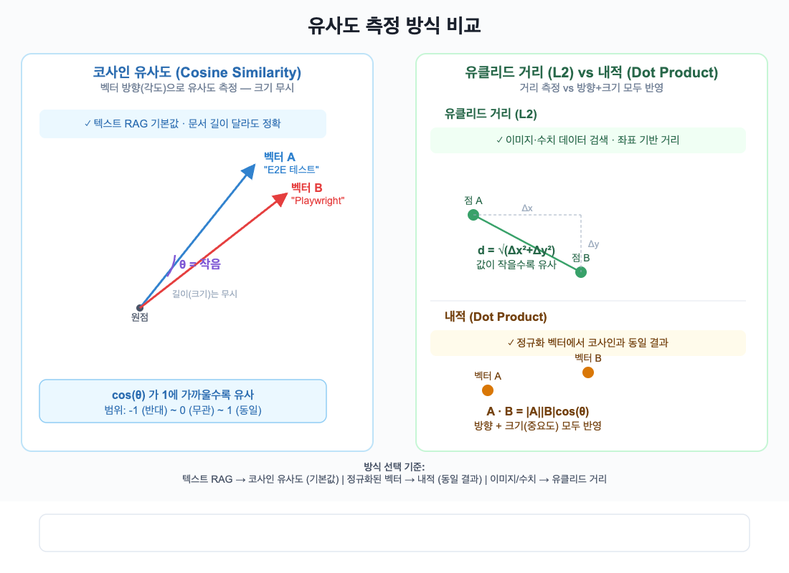
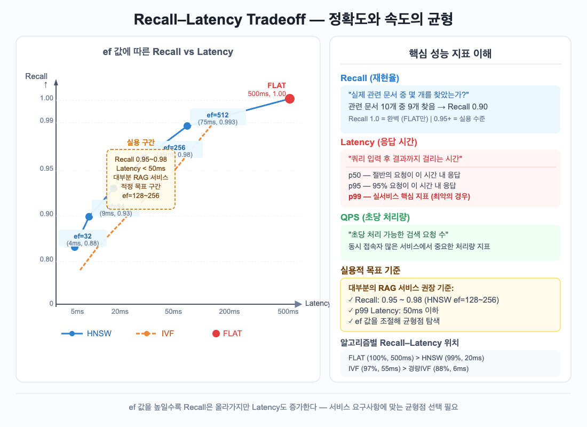
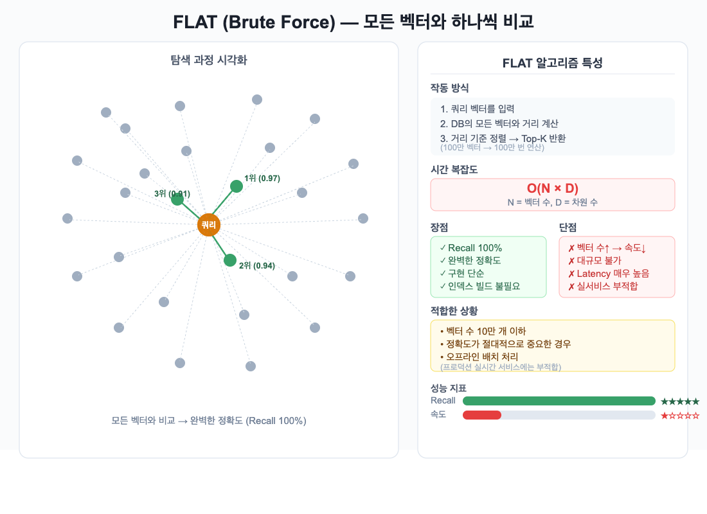
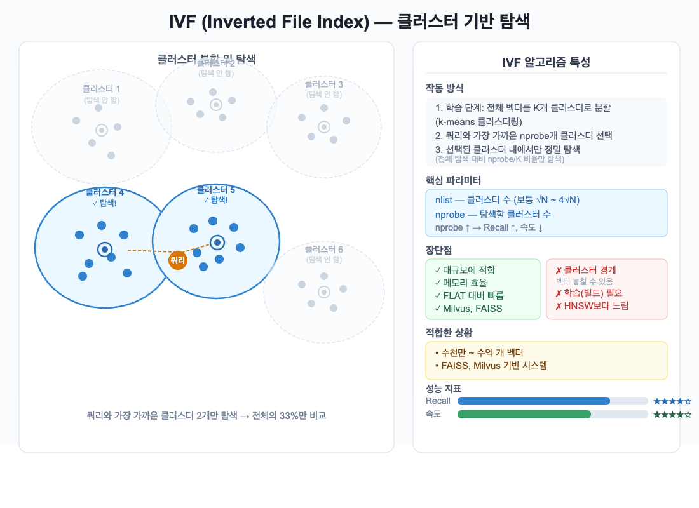
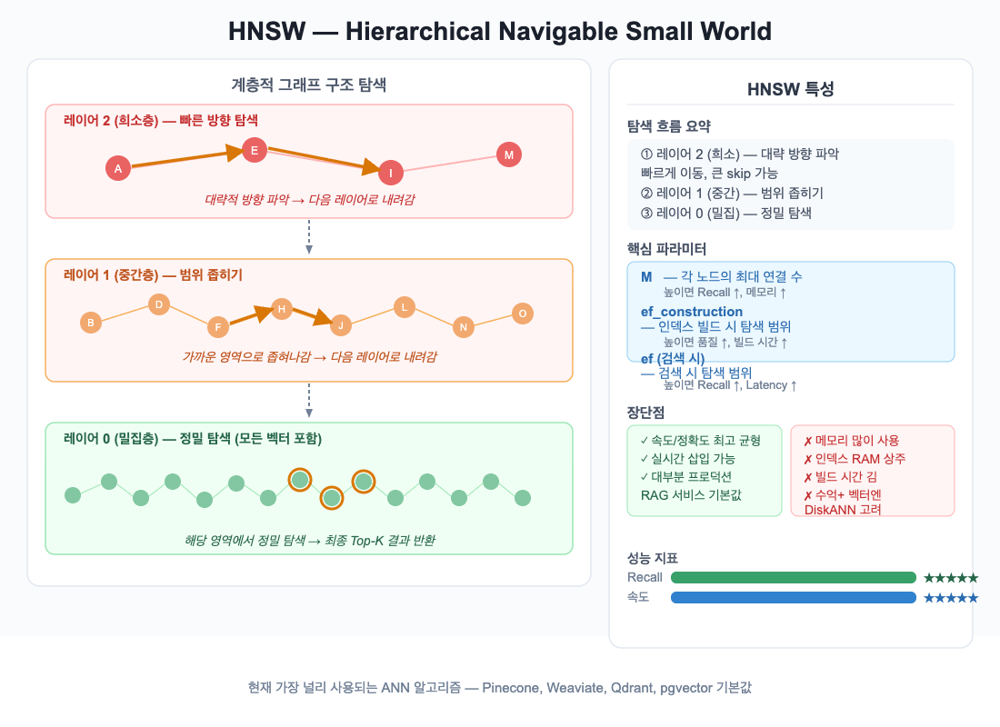
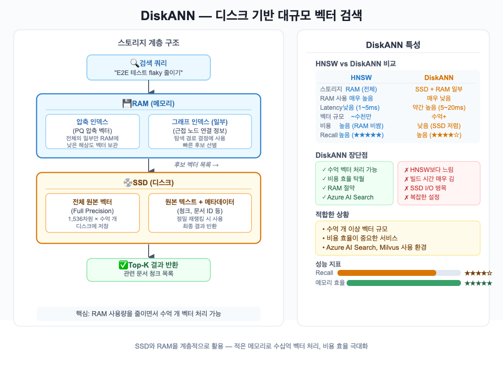

사내 문서 검색을 개선하려다가 이상한 벽에 부딪혔어요.

"E2E 테스트 관련 문서 찾아줘"라는 질문에 기존 검색은 `E2E`, `테스트`라는 단어가 들어간 문서만 돌려줬거든요. `Playwright 셋업 가이드`는 분명 같은 주제인데 검색 결과에 없었어요. 제목에 그 단어가 없으니까요.

Confluence 검색창을 바라보며 든 생각 — "이건 단어를 찾는 거지, 의미를 찾는 게 아니구나."

그래서 RAG(Retrieval-Augmented Generation)를 파기 시작했어요. 오늘은 그 과정에서 배운 것들, 벡터 DB의 기초부터 ANN 알고리즘까지를 정리해 볼게요.

## 왜 기존 DB로는 안 되는 걸까요

RDB(MySQL, PostgreSQL)는 정확한 값을 빠르게 찾는 데 최적화되어 있어요.

```sql
-- 이런 쿼리는 RDB가 완벽하게 처리해요
SELECT * FROM documents WHERE title = 'E2E 테스트 가이드';
```

근데 이런 질문은 못 해요.

```
"E2E 테스트와 비슷한 주제의 문서를 찾아줘"
"이 문장과 의미적으로 가장 가까운 FAQ 항목은?"
```

RDB는 값이 **정확히 일치**하거나 **포함**되는지만 판단할 수 있거든요. 의미가 비슷한지는 판단 못 해요.

| 항목 | RDB | 벡터 DB |
|------|-----|---------|
| 검색 방식 | 정확한 값 매칭 (=, LIKE, IN) | 의미적 유사도 |
| 저장 단위 | 행(Row), 컬럼 | 벡터(고차원 숫자 배열) |
| 강점 | 트랜잭션, 정합성, JOIN | 자연어 이해, 비정형 데이터 |
| 약점 | 의미 기반 검색 불가 | 정확한 값 조회 약함 |

벡터 DB가 필요한 이유가 여기 있어요. 의미를 숫자로 바꿔서 비교하는 거예요. 그럼 "의미를 숫자로 바꾼다"는 게 실제로 어떤 뜻인지 볼게요.

## 임베딩: 의미를 숫자 배열로 변환한다는 게 뭔 뜻이에요

**임베딩(Embedding)**은 텍스트를 수백~수천 차원의 숫자 배열(벡터)로 변환하는 기술이에요. 핵심은 이거예요 — 의미가 비슷한 텍스트는 벡터 공간에서 **가까운 위치**에 놓여요.

```
"E2E 테스트 자동화"
  → [0.12, -0.45, 0.78, ...]  # 벡터 A

"Playwright 셋업 방법"
  → [0.14, -0.43, 0.76, ...]  # 벡터 B (A와 가까움)

"오늘 점심 뭐 먹을까"
  → [0.91,  0.32, -0.11, ...]  # 벡터 C (A와 멀음)
```



테스트/QA 관련 문서들은 같은 클러스터에 모이고, 음식 관련 문서는 멀리 떨어지죠. 검색 쿼리(주황색)와 가장 가까운 벡터들이 바로 관련 문서가 되는 거예요.

처음에 임베딩 값을 직접 찍어봤을 때 1,536개 숫자가 줄줄 나오는 걸 보고 당황했어요. 근데 이 숫자들이 의미의 각 차원을 표현하는 거거든요. 차원이 높을수록 의미를 더 풍부하게 담을 수 있지만, 저장 공간과 연산 비용도 커지죠.

| 모델 | 차원 | 특징 |
|------|------|------|
| text-embedding-3-small | 1,536 | OpenAI 경량, 빠름 |
| text-embedding-3-large | 3,072 | OpenAI 고품질 |
| BGE-M3 | 1,024 | 오픈소스, 다국어 강함 |
| KoSimCSE | 768 | 한국어 특화 |

임베딩 모델이 의미를 벡터로 변환해준다는 건 알겠는데, 이 벡터들이 실제 검색에서 어떻게 쓰이는 걸까요.

## RAG 파이프라인: AI가 실제로 문서를 찾는 흐름

RAG는 AI가 모르는 내용을 외부 문서에서 찾아와 답하게 하는 방식이에요. 크게 세 단계로 나뉘어요.



**① 사전 준비 (Indexing)** — 문서를 벡터 DB에 저장해요.

```
원본 문서 수집 → 청킹(Chunking) → 임베딩 변환 → 벡터 DB 저장
```

청킹이 중요해요. 너무 크게 자르면 관련 없는 내용이 섞이고, 너무 작게 자르면 맥락이 사라지거든요.

**② 검색 (Retrieval)** — 질문을 벡터로 만들고 가장 가까운 청크들을 찾아요.

**③ 생성 (Generation)** — 검색된 청크들 + 질문을 LLM에 넘기면 문서 기반 답변이 나와요.

**핵심은 이거예요.** 벡터 DB 검색 품질이 RAG 전체 품질을 결정해요. 관련 문서를 못 찾으면 LLM이 아무리 좋아도 정확한 답을 낼 수 없거든요.

그럼 "가장 가까운 벡터를 찾는다"는 게 구체적으로 어떻게 계산되는 걸까요.

## 유사도를 어떻게 계산하나요

벡터 사이의 거리를 계산하는 방식이 세 가지 있어요.



**코사인 유사도** — 두 벡터 사이의 각도를 기준으로 유사도를 측정해요. 벡터 크기는 무시하고 방향만 비교하죠. 텍스트 유사도 검색의 기본값이에요.

**내적 (Dot Product)** — 방향과 크기 모두 반영해요. 벡터가 정규화되어 있으면 코사인 유사도와 동일한 결과가 나와요.

**유클리드 거리 (L2)** — 두 점 사이의 직선 거리예요. 벡터가 정규화되어 있으면 L2와 코사인 유사도는 수학적으로 동일한 결과를 내요. 정규화되지 않은 상태에서는 이미지·수치 데이터 검색에 더 자주 쓰여요.

텍스트 RAG라면 코사인 유사도를 기본으로 써요. 계산 방식은 정했는데, 이 검색이 "잘 된다"는 걸 어떻게 판단할 수 있을까요.

## Recall과 Latency: 성능을 보는 눈

벡터 DB 성능 이야기를 할 때 반드시 나오는 지표들이에요.



**Recall(재현율)**: "실제로 관련 있는 문서 중, 몇 개를 찾아냈는가?"
- Recall 1.0 = 완벽 (Brute Force만 가능)
- Recall 0.95 이상 = 실용적 수준
- Recall 0.80 이하 = 체감되는 품질 저하

**Latency**: 질문 넣고 결과 나올 때까지 걸리는 시간이에요. 실서비스에서는 p99가 중요해요. p50이 5ms라도 p99가 500ms면 일부 사용자는 매우 느린 경험을 하거든요.

가장 중요한 원칙은 이거예요.

> 더 정확하게 찾을수록 더 오래 걸리고, 더 빠를수록 덜 정확해져요.

많은 RAG 서비스의 합리적인 목표 구간은 **Recall 0.95~0.98, p99 Latency 50ms 이하**예요. 정확도가 더 중요한 금융·의료 같은 도메인에서는 Recall 0.99+를 요구하기도 해요. 이 목표를 현실적으로 달성하려면 어떤 알고리즘을 써야 할까요.

## ANN 알고리즘: 왜 정확도를 조금 포기하는가

수억 개 벡터를 모두 비교하는 건 현실적으로 불가능해요. 그래서 대부분의 벡터 DB는 **근사 최근접 이웃(ANN)** 알고리즘을 사용해요.

### FLAT — Brute Force



가장 단순해요. 모든 벡터와 하나씩 비교해요. Recall 100%지만 시간 복잡도가 O(N × D)라 데이터가 많아지면 쓸 수가 없어요. 10만 개 이하, 정확도가 절대적으로 중요한 경우에만 적합해요.

### IVF — 클러스터 기반 탐색



전체 벡터를 클러스터로 나눈 뒤, 쿼리와 가까운 클러스터만 탐색하는 방식이에요.

```
100개 클러스터로 나눔
→ 가장 가까운 5개만 탐색
→ 전체의 5%만 비교
```

`nprobe` 파라미터로 탐색할 클러스터 수를 조절해요. 수천만~수억 개 벡터 규모에 적합하고, FAISS·Milvus가 여기서 강해요.

### HNSW — 현재 가장 널리 쓰이는 알고리즘



계층적 그래프 구조로 탐색해요.

```
레이어 2 (희소)  → 대략적 방향 파악
레이어 1 (중간)  → 범위 좁히기
레이어 0 (밀집)  → 정밀 탐색, 최종 반환
```

속도와 정확도 균형이 가장 좋고, 실시간 삽입도 가능해요. Pinecone, Weaviate, Qdrant, pgvector가 모두 HNSW를 기본으로 사용하는 이유예요.

| 파라미터 | 역할 | 높이면 |
|---------|------|--------|
| `M` | 각 노드의 최대 연결 수 | Recall ↑, 메모리 ↑ |
| `ef_construction` | 인덱스 빌드 시 탐색 범위 | 품질 ↑, 빌드 시간 ↑ |
| `ef` (검색 시) | 검색 시 탐색 범위 | Recall ↑, Latency ↑ |

실제로 `ef` 값을 조정해가며 Recall을 측정해봤는데, 1,536차원 벡터 기준으로 ef=128 언저리에서 Recall 0.96, Latency 18ms 구간에 들어오더라고요. 데이터셋과 하드웨어에 따라 달라지지만, 앞서 말한 목표 구간이 여기예요.

### DiskANN — 수억 벡터를 저비용으로



HNSW의 약점은 인덱스가 RAM에 올라가야 한다는 거예요. 수억 개 벡터면 RAM 비용이 엄청나거든요. DiskANN은 인덱스를 SSD에 저장해서 이 문제를 해결해요.

| | HNSW | DiskANN |
|--|------|---------|
| 스토리지 | RAM 전체 | SSD + RAM 일부 |
| Latency | 1~5ms | 5~20ms |
| 벡터 규모 | ~수천만 | 수억+ |
| 비용 | 높음 | 낮음 |

Latency가 약간 높지만, 수십억 벡터를 훨씬 적은 비용으로 처리할 수 있어요.

### 알고리즘 선택 기준

| 알고리즘 | Recall | 속도 | 메모리 | 적합한 규모 |
|---------|--------|------|--------|-----------|
| FLAT | ★★★★★ | ★ | ★★★ | ~10만 |
| IVF | ★★★★ | ★★★★ | ★★★★ | 천만~억 |
| HNSW | ★★★★☆† | ★★★★★ | ★★ | 만~천만 |
| DiskANN | ★★★★ | ★★★★ | ★★★★★ | 억+ |

† HNSW는 ANN(근사)이라 100% Recall을 보장하지 않아요. ef 값으로 0.99+까지 높일 수 있지만, 수학적 보장은 FLAT만 가능해요.

알고리즘을 잘 골랐다고 끝이 아니에요. 여기서 한 가지 더 신경 써야 할 게 있어요.

## 임베딩 모델이 사실 더 중요해요

벡터 DB를 아무리 잘 골라도 임베딩 모델이 의미를 제대로 표현하지 못하면 검색이 실패해요. 직접 경험해봤는데, 같은 문서셋에 같은 HNSW 인덱스를 써도 일반 다국어 모델과 한국어 특화 모델 사이에 Recall이 눈에 띄게 달랐어요. 모델이 "E2E 테스트"와 "자동화 품질 검증"을 다른 의미로 인식하면, 관련 문서를 아예 못 찾는 거거든요.

한국어 RAG라면 한국어 성능이 높은 모델 선택이 필수예요.

| 모델 | 한국어 성능 | 비용 | 자체 호스팅 |
|------|-----------|------|-----------|
| text-embedding-3-small | 양호 | $0.02/1M 토큰 | ❌ |
| text-embedding-3-large | 좋음 | $0.13/1M 토큰 | ❌ |
| BGE-M3 | 우수 | 무료 | ✅ |
| KoSimCSE-roberta | 한국어 특화 | 무료 | ✅ |

빠르게 시작하려면 `text-embedding-3-small`, 비용을 줄이고 싶다면 `BGE-M3`, 순수 한국어 문서라면 `KoSimCSE-roberta`가 출발점이에요. 단, 한국어 임베딩 모델은 빠르게 발전하고 있어서 적용 시점에 [KoEB 벤치마크](https://github.com/korean-embedding/korean-embedding-benchmark) 최신 순위를 확인하는 걸 권장해요.

## 정리

RAG 시스템을 처음 접하면 "어떤 벡터 DB를 써야 하지?"부터 고민하게 되는데, 사실 그보다 먼저 임베딩 모델을 잘 고르는 게 더 중요해요. 좋은 DB도 나쁜 임베딩 위에서는 제 실력을 못 내거든요.

| 개념 | 한 줄 요약 |
|------|-----------|
| 임베딩 | 텍스트를 벡터로 변환, 의미가 비슷하면 벡터가 가깝다 |
| 벡터 DB | 벡터를 저장하고 유사한 것을 빠르게 찾는 DB |
| RAG | AI가 외부 문서에서 관련 내용을 찾아 답하는 방식 |
| HNSW | 가장 널리 쓰이는 ANN 알고리즘, 속도/정확도 균형 |
| 임베딩 모델 | 검색 품질의 핵심, DB보다 중요 |

다음 편에서는 실제로 데이터를 어떻게 준비하고 청킹 전략을 어떻게 세우는지 살펴볼게요. 청킹 방식이 Recall에 얼마나 큰 영향을 주는지 수치로 보여드릴 거예요.
